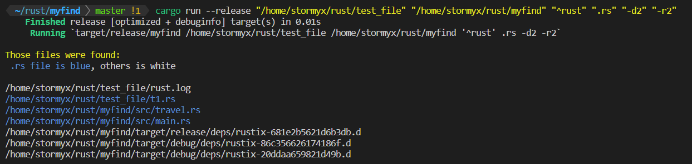
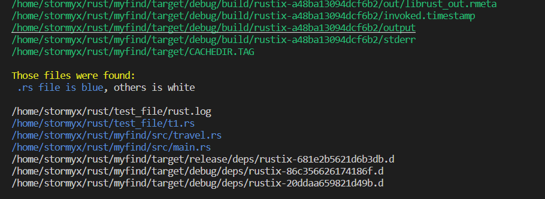

# MyFind

## Introduction

An implementation of the bash command "find".

## Use guide
the way to use: 
```bash
    the way to use: {} <target dir> <Regex> -dx -ry (-v)
```
    

Inorder not to be misunderstood by the shell, you are recommended to surround each `arg` with `""`.

The `"target dir"` and `\"Regex\"` can both be `one or more`.\
Multiple `targets` will increase the `finding dir`.\
Multiple `regexes` will use logic `||(or)` to match the file.\

example:
```bash
cargo run --release "/home/user_name/rust/test_file" "/home/user_name/rust/myfind" "^rust" ".rs" "^[A-Za-z]\w+" "-d2" "-r3" "-v"
```

-h --help　　　　        show the help and exit\
-v     　　  　　　　　show the file, `in green`, traveled during the find\
-dx -ry 　　　　　`CAN'T BE MISSED`;　x means the number of directories, y means the number of regexes.

And it's worth pointing that the color of the output file with the extension of `rs` will be `blue`.　While some errors will be shown in `red`.

## Some details

* Two functions (find and travel_dir) are moved to `mod travel`.
* Adding `-v` to the last argument can print the files visited in the process.
* You can add more than one path in one find by changing `-dx`
* The same to regex.
* The `.rs` file will be shown in blue.

## Some examples

The following example is no "-v" option.
```bash
cargo run --release "/home/stormyx/rust/test_file" "/home/stormyx/rust/myfind" "^rust" ".rs" "-d2" "-r2"     
```


The following example has the "-v" option. And those green one are files visited in the process.

```bash
cargo run --release "/home/stormyx/rust/test_file" "/home/stormyx/rust/myfind" "^rust" ".rs" "-d2" "-r2" -v  
 ```

